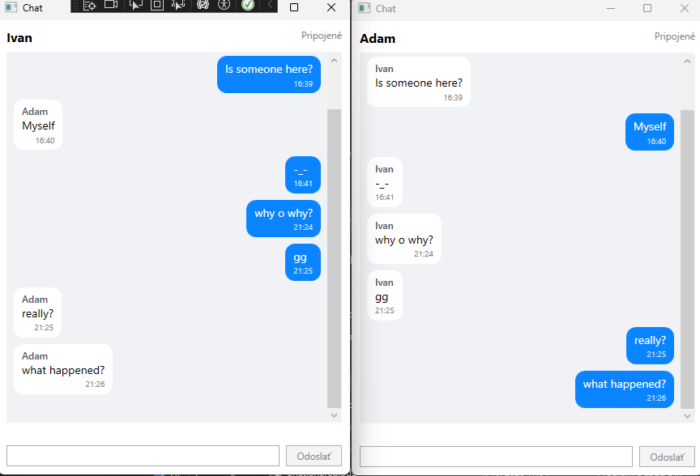

# ChatApp – real-time chat (WPF + ASP.NET Core + SignalR)

Jednoduchá desktopová chatovacia aplikácia. Viacero WPF klientov komunikuje cez server v reálnom čase, správy sa ukladajú do MySQL databázy.



## Funkcie

- prihlásenie zadaním mena (nový používateľ sa vytvorí automaticky)
- posielanie a príjem správ v reálnom čase cez WebSocket (SignalR)
- história posledných 50 správ pri otvorení chatu
- zobrazenie stavu pripojenia a automatické znovupripojenie pri výpadku servera
- vlastné správy vpravo, cudzie vľavo
- validácia na klientovi aj na serveri (prázdne meno/správa, max. dĺžka)

## Technológie

| Vrstva | Technológia |
|---|---|
| Server | ASP.NET Core 9 (Web API + SignalR) |
| Databáza | MySQL 8.4, Entity Framework Core 9 (Pomelo provider), code-first migrácie |
| Klient | WPF (.NET 9), MVVM cez CommunityToolkit.Mvvm, Microsoft.Extensions.DependencyInjection |
| Komunikácia | REST (login, história) + SignalR/WebSocket (real-time správy) |

## Architektúra

```
┌──────────────┐   REST: login, história    ┌─────────────────────┐        ┌─────────┐
│ WPF klient 1 │ ─────────────────────────► │  Chat.Server        │        │         │
│   (MVVM)     │ ◄═══ SignalR / WebSocket ═►│  - Controllers      │ ─────► │  MySQL  │
└──────────────┘                            │  - ChatHub          │  EF    │         │
┌──────────────┐                            │  - ChatDbContext    │  Core  │         │
│ WPF klient N │ ◄═══ SignalR / WebSocket ═►│                     │        │         │
└──────────────┘                            └─────────────────────┘        └─────────┘
```

Solution má tri projekty:

- **Chat.Server**: ASP.NET Core server s REST API, SignalR hubom a prístupom k databáze.
- **Chat.Client**: WPF aplikácia (MVVM). Služby `ChatApiClient` (REST) a `ChatHubClient` (SignalR) oddeľujú komunikáciu od ViewModelov.
- **Chat.Shared**: spoločný kontrakt medzi serverom a klientom, teda DTO a rozhrania hubu (`IChatHub` = metódy volané klientom, `IChatClient` = metódy volané serverom).

## Spustenie

### Požiadavky

- [.NET 9 SDK](https://dotnet.microsoft.com/download/dotnet/9.0)
- [Docker Desktop](https://www.docker.com/products/docker-desktop/), alebo lokálne nainštalovaný MySQL 8.x
- Windows (WPF klient)

### 1. Databáza

```bash
docker compose up -d
```

Spustí MySQL na porte `3306` s databázou `chatapp` (používateľ `chat` / heslo `chat`).

> Bez Dockera: v `Chat.Server/appsettings.json` uprav connection string na svoju inštaláciu MySQL. Databázu netreba vytvárať ručne.

### 2. Server

```bash
dotnet run --project Chat.Server
```

Server beží na `http://localhost:5076`. Pri štarte automaticky aplikuje EF migrácie, takže tabuľky vytvorí sám.

### 3. Klienti

V ďalších termináloch (pre každého klienta jeden):

```bash
dotnet run --project Chat.Client
```

Alebo vo Visual Studiu: v *Configure Startup Projects* nastav spúšťanie `Chat.Server` aj `Chat.Client`, spusti F5 a ďalšieho klienta otvor cez pravý klik na **Chat.Client → Debug → Start New Instance**.

Prihlás sa v každom okne iným menom a pošli správu. Objaví sa okamžite vo všetkých oknách.

## API

### REST

| Metóda | Endpoint | Popis |
|---|---|---|
| `POST` | `/api/users/login` | Body `{ "username": "ivan" }`. Vráti existujúceho používateľa alebo vytvorí nového. |
| `GET` | `/api/messages?take=50` | Posledných N správ (max. 100), zoradené od najstaršej. |

Requesty na vyskúšanie sú v `Chat.Server/Chat.Server.http`.

### SignalR – `/hubs/chat`

| Smer | Metóda | Popis |
|---|---|---|
| klient → server | `SendMessage(userId, content)` | Uloží správu a rozpošle ju všetkým klientom. |
| server → klient | `ReceiveMessage(MessageDto)` | Nová správa (prijímajú všetci vrátane odosielateľa). |

## Ako putuje jedna správa

1. Klient zavolá `SendMessage` cez SignalR.
2. Hub správu zvaliduje a **najprv ju uloží do databázy**.
3. Až potom ju pošle všetkým klientom cez `ReceiveMessage`, už s ID a časom zo servera.
4. Klient ju na UI vlákne (cez `Dispatcher`) pridá do `ObservableCollection` a WPF ju vykreslí.

Odosielateľ si správu nepridáva sám, dostane ju späť od servera ako ostatní. Zobrazí sa teda až vtedy, keď je naozaj uložená.

## Rozhodnutia a ich dôvody

- **SignalR namiesto čistého REST.** Zadanie pripúšťalo aj REST s čo najmenšou záťažou. Polling by buď zaťažoval server, alebo zdržiaval správy, a long polling je v podstate ručná implementácia toho, čo SignalR už rieši. SignalR štandardne beží cez WebSocket a navyše rieši reconnect, serializáciu a broadcast. REST zostal na operácie typu otázka–odpoveď (login, história).
- **Najprv uložiť, potom rozposlať.** Keby uloženie zlyhalo po rozposlaní, používatelia by videli správu, ktorá v databáze neexistuje.
- **Poradie pri otvorení chatu: pripojenie na hub → načítanie histórie.** Opačné poradie by mohlo stratiť správu, ktorá príde medzi načítaním histórie a pripojením. Prípadné duplicity sa odfiltrujú podľa ID.
- **Zdieľaný kontrakt v `Chat.Shared` a silne typovaný hub (`Hub<IChatClient>`, `IChatHub`).** Nezhoda medzi serverom a klientom (napr. preklep v názve metódy) sa prejaví pri kompilácii, nie až za behu.
- **EF Core code-first s migráciami.** Schéma je verzovaná v gite spolu s kódom a server ju pri štarte aplikuje sám.
- **Časy v UTC.** Server ukladá a posiela UTC, klient ich zobrazuje v lokálnom čase.
- **Validácia na oboch stranách.** Klient kvôli pohodliu používateľa (`MaxLength`, neaktívne tlačidlo), server kvôli bezpečnosti a databáza ako posledná línia obrany (unikátny index na meno, `varchar` limity).

## Poznámka k prihlasovacím údajom

Heslá v `docker-compose.yml` a `appsettings.json` sú len pre lokálny vývoj. V produkcii by som ich načítal z premenných prostredia alebo zo správcu tajomstiev (napr. User Secrets, Azure Key Vault).
